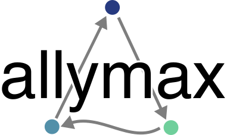

# AllyMax
##### A high-parallelism minimax search

AllyMax is a parallel minimax search algorithm that is capable of efficiently choosing optimal moves in any adversarial, turn-based game that you provide a rule set and heuristic for. 

The defining features of AllyMax relative to other parallel minimax algorithms are:
* Realtime alpha/beta values of all nodes are visible to all of their descendants (meaning alpha improvements are immediately leveraged by other threads, even if those threads are in distant areas of the search tree)
* Parallel subtree evaluation jobs are queued in batched increments based on a CPU core # hint to avoid queueing excessive amounts of redundant work
* Child exploration threads are capable of assuming control of parent nodes without returning back to the execution context
* Shallow node explorations are evaluated without parallelism (as an optimization, if remaining depth <= 1)
* Completely non-blocking

AllyMax leverages a handful of concurrency primitives to accomplish this:
* Atomic References/STM
* Java 8 style accumulators
* `Future`s/`Promise`s for threading control (scala.concurrent)
* Concurrently modifiable `Map`s with eviction (Scaffeine)
